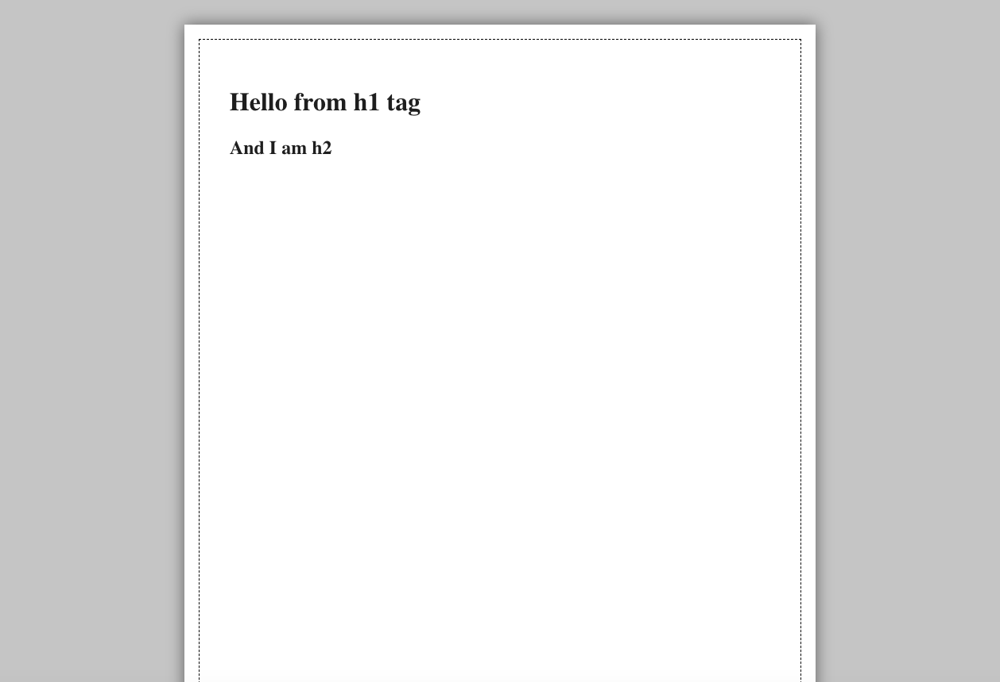

# HTML A4 Paper

If you are a web developer who is sick of setting your documents layout...

Create your own A4 page with HTML and CSS!!

```html
<body>
  <div class="page">
    <!-- Your content here -->
    <h1>Hello from h1 tag</h1>
    <h2>And I am h2</h2>
    <!-- End of your content -->
  </div>
</body>
```

<p align="center"></p>

## Installation

```bash
git clone https://github.com/kykungz/html-a4-paper.git
```

## Custom bleeding and margin

You can specify [bleeding and margin](https://www.printsimple.eu/en-be/help/what-are-bleed-safety-margin-and-safe-zone) via [CSS Variables](https://www.w3schools.com/css/css3_variables.asp).

```html
<body style="--bleeding: 0.5cm;--margin: 1cm;">
  <div class="page">
    <!-- Your content here -->
  </div>
</body>
```

## Add more pages

You can add more pages with `<div class="page"></div>`

```html
<body>
  <!-- 3 Pages -->
  <div class="page">Page 1</div>
  <div class="page">Page 2</div>
  <div class="page">Page 3</div>
</body>
```

## Save to PDF

1. Open in Chrome (Recommended)
2. Press `Ctrl+P` or `Cmd+P`
3. Change the destination to `Save as PDF`
